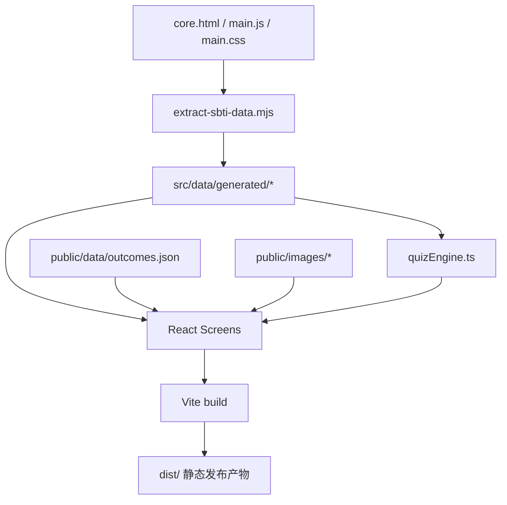

# SBTI Rebuild

> 一个以 `core.html` 为业务真源、以本地静态部署为发布边界的 SBTI 前端复刻项目。
>
> 这一版选择 `Vite + React + TypeScript + CSS Modules` 作为开发底座，但最终产物仍然是可以直接部署到任意静态托管平台的一组前端文件，不依赖服务器、不依赖数据库、也不依赖远端脚本。

> 这是一个完全公益、完全开源、无任何商业收益预期的整理与复刻项目。做它的目的，不是把原作“改头换面”拿去变现，而是尽量把一份有趣的互联网作品整理成更容易开发、维护、复查和继续完善的版本。

## 项目定位

这个仓库不是对原页面的“简单搬运”，而是一次更适合长期维护的工程化复刻。

它解决的不是“能不能跑”，而是下面这些问题：

- 能不能把原始页面里埋在大脚本里的题库、维度、人格类型和结果规则拆出来。
- 能不能在不依赖 B 站远端脚本的前提下，本地离线跑完整个测验流程。
- 能不能把后续维护成本降下来，让界面、规则、文案、资源各自有清晰边界。
- 能不能最终仍然发布成纯静态站，做到零后端、低成本、易部署。

## 这版已经做了什么

### 1. 重新建立了“可信来源”

我们没有把 [index.js](C:/Users/30847/Desktop/SBTI/index.js) 和 [index_native.js](C:/Users/30847/Desktop/SBTI/index_native.js) 当成业务逻辑来源。

当前采用的判断是：

- [core.html](C:/Users/30847/Desktop/SBTI/core.html) 是业务真源。
- [main.js](C:/Users/30847/Desktop/SBTI/main.js) 是高价值的本地逻辑镜像，便于阅读和迁移。
- [main.css](C:/Users/30847/Desktop/SBTI/main.css) 是高价值的视觉骨架参考。
- `index_native.js` 更接近监控层，不参与复刻运行时。
- `index.js` 更接近配置层，不作为题库或评分逻辑来源。

### 2. 把原始页面中的业务数据拆成了独立模块

我们已经把原本混在大脚本里的内容抽离到 `src/data/generated/*`：

- 题库
- 15 维度定义
- 人格类型库
- 作者文案与补充文案
- 相关静态资源映射

这样做之后，后续再改题目、查维度、核对类型，不需要回到一整坨 HTML/JS 里继续考古。

### 3. 把核心评分逻辑独立成了可测试的引擎

核心逻辑现在集中在：

- [quizEngine.ts](C:/Users/30847/Desktop/SBTI/sbti-app/src/lib/quizEngine.ts)

它负责：

- 题目显隐
- 进度计算
- 维度分数计算
- 类型匹配
- `DRUNK` 隐藏人格逻辑
- `HHHH` 兜底人格逻辑

并且已经配套了测试：

- [quizEngine.test.ts](C:/Users/30847/Desktop/SBTI/sbti-app/src/lib/quizEngine.test.ts)

这意味着后续继续调整界面时，不容易把评分逻辑悄悄改坏。

### 4. 做成了清晰的单页应用结构

当前页面流程已经整理为三段：

- `intro`
- `test`
- `result`

对应文件：

- [IntroScreen.tsx](C:/Users/30847/Desktop/SBTI/sbti-app/src/screens/IntroScreen.tsx)
- [TestScreen.tsx](C:/Users/30847/Desktop/SBTI/sbti-app/src/screens/TestScreen.tsx)
- [ResultScreen.tsx](C:/Users/30847/Desktop/SBTI/sbti-app/src/screens/ResultScreen.tsx)

这和原始项目“少文件但耦合很重”的方式不同。我们这版的目标是让每个页面职责清楚，后面继续迭代时不容易牵一发而动全身。

### 5. 复用了参考仓库的可用成果

我们参考了：

- [serenakeyitan/sbti-wiki](https://github.com/serenakeyitan/sbti-wiki)

当前复用的是：

- 结果数据结构
- 结果图资源
- 静态百科式展示思路

已经接入到：

- [public/data/outcomes.json](C:/Users/30847/Desktop/SBTI/sbti-app/public/data/outcomes.json)
- [public/images](C:/Users/30847/Desktop/SBTI/sbti-app/public/images)

说明一下：由于当前 GitHub token 权限不足，无法直接 fork 到账号下，所以采取的是本地克隆参考仓库并复用可复用资产的策略。

## 为什么文件比原作者多

原作者的实现更偏向“把所有东西塞进少量文件里直接跑起来”。

我们这版增加的不是“无意义复杂度”，而是下面几类工程能力：

| 层次 | 当前落点 | 解决的问题 |
| --- | --- | --- |
| 文档层 | `README.md`、`docs/project-foundation.md` | 把方案写死，防止后续偏航 |
| 数据层 | `src/data/generated/*` | 题库、维度、类型可独立维护 |
| 逻辑层 | `src/lib/quizEngine.ts` | 评分逻辑可复用、可测试 |
| 页面层 | `src/screens/*` | 页面职责清晰，便于继续复刻 |
| 样式层 | `CSS Modules + tokens.css` | 降低样式串扰 |
| 验证层 | `vitest` | 防止改动引入回归问题 |

换句话说：

- 原作者更适合快速发布。
- 这一版更适合长期维护和继续开源整理。

## 技术方案

### 开发栈

| 类别 | 选择 |
| --- | --- |
| 构建工具 | Vite |
| UI 框架 | React |
| 语言 | TypeScript |
| 样式方案 | CSS Modules |
| 测试 | Vitest |
| 发布形态 | 纯静态文件 |

### 发布边界

虽然开发时用了 React 和 Vite，但上线并不需要 Node 服务。

执行：

```bash
npm run build
```

会生成：

- [dist](C:/Users/30847/Desktop/SBTI/sbti-app/dist)

这个目录就是最终发布产物。它包含：

- `index.html`
- 编译后的 JS
- 编译后的 CSS
- 本地 JSON 数据
- 结果图片资源

也就是说，这一版完全可以部署到：

- GitHub Pages
- Cloudflare Pages
- Netlify
- 任意静态文件服务器

如果你没有预算买服务器，这套方案完全够用。

## 架构概览



## 目录结构

```text
sbti-app/
├─ docs/
│  └─ project-foundation.md
├─ public/
│  ├─ data/
│  │  └─ outcomes.json
│  └─ images/
├─ scripts/
│  └─ extract-sbti-data.mjs
├─ src/
│  ├─ components/
│  ├─ data/
│  │  └─ generated/
│  ├─ lib/
│  ├─ screens/
│  ├─ styles/
│  ├─ types/
│  ├─ App.tsx
│  └─ main.tsx
└─ dist/
```

## 开发命令

```bash
npm install
npm run extract:data
npm run dev
npm run test
npm run build
```

命令说明：

- `npm run extract:data`
  从本地素材中提取题库、维度、类型和文案，生成 `src/data/generated/*`

- `npm run dev`
  本地开发预览

- `npm run test`
  运行评分逻辑测试

- `npm run build`
  生成最终静态站产物到 `dist/`

## 数据与素材来源

当前复刻主要依赖以下本地资料：

- [core.html](C:/Users/30847/Desktop/SBTI/core.html)
- [main.js](C:/Users/30847/Desktop/SBTI/main.js)
- [main.css](C:/Users/30847/Desktop/SBTI/main.css)
- [writerspeak.md](C:/Users/30847/Desktop/SBTI/writerspeak.md)
- [SBTI (Silly Big Personality Test) 27 种人格资料全集.pdf](C:/Users/30847/Desktop/SBTI/SBTI%20%28Silly%20Big%20Personality%20Test%29%2027%20%E7%A7%8D%E4%BA%BA%E6%A0%BC%E8%B5%84%E6%96%99%E5%85%A8%E9%9B%86.pdf)
- [答题页面风格.png](C:/Users/30847/Desktop/SBTI/%E7%AD%94%E9%A2%98%E9%A1%B5%E9%9D%A2%E9%A3%8E%E6%A0%BC.png)
- [结算页面风格.png](C:/Users/30847/Desktop/SBTI/%E7%BB%93%E7%AE%97%E9%A1%B5%E9%9D%A2%E9%A3%8E%E6%A0%BC.png)

外部参考仓库：

- [sbti-wiki-ref](C:/Users/30847/Desktop/SBTI/sbti-wiki-ref)

## 当前完成状态

### 已完成

- 单页应用基础流程已搭好
- 原始题库和类型数据已抽离
- 结果页可根据本地计算结果渲染
- 已接入结果图与结果文案
- 核心流程支持离线运行
- 测试通过
- 构建通过

### 暂未做

- 完整像素级视觉精修
- 更激进的移动端首屏同构
- 自动化部署脚本
- 极简三文件静态版导出

## 这版和“超轻量三文件版”的关系

这个仓库当前选择的是“工程化开发，静态化发布”的路线。

也就是说：

- 开发时文件较多，是为了维护方便。
- 发布时仍然只有一套静态产物，不需要后端。

如果后续需要，我们也可以在这套工程基础上再导出一版更极简的：

- `index.html`
- `main.js`
- `main.css`
- `images/*`

那会更接近原始项目的形态，但建议在当前工程版稳定之后再做。

## 致谢与说明

首先要认真感谢原始 SBTI 项目的作者和最初把这套内容做出来的人。

这个仓库能够成立，不是因为我们“重新发明”了什么，而是因为前人已经完成了最重要、也最有灵气的那部分工作：

- 原始题目设计
- 人格类型设定
- 结果文案与整体气质
- 页面节奏与表达风格

我们所做的，更多是整理、提取、复刻、工程化，而不是替代原作。

同时也感谢：

- [`core.html`](C:/Users/30847/Desktop/SBTI/core.html) 所承载的原始页面逻辑
- [main.js](C:/Users/30847/Desktop/SBTI/main.js) 与 [main.css](C:/Users/30847/Desktop/SBTI/main.css) 提供的高价值本地镜像
- [serenakeyitan/sbti-wiki](https://github.com/serenakeyitan/sbti-wiki) 提供的静态整理思路和部分可复用结果资源

如果原作者或相关整理者认为这里有需要进一步标注、修正或删改的地方，欢迎直接提出，我们会认真对待。

## 公益开源立场

这个项目从一开始就不是商业项目。

这里明确说明：

- 本项目完全公益开源
- 不以盈利为目的
- 不准备接入商业化后端
- 不希望把它包装成收费产品
- 不鼓励任何借此进行二次售卖、引流套利或灰色变现的行为

做这件事的初衷很简单：

- 让项目结构更清楚
- 让后续开发更容易
- 让逻辑更容易检查
- 让静态部署更容易落地
- 让想继续维护的人更容易接手

## 关于 AI 协作

由于时间确实比较紧，这一版里的绝大多数代码都由 AI 协助生成、整理和重构完成。

这不意味着这个仓库会对质量放弃要求，恰恰相反，这也是为什么我们把题库、类型、规则、页面和测试拆开来做的原因之一：只有结构清楚，AI 生成的内容才更容易被人类检查、修正和持续维护。

所以这里也提前说明两点：

- 如果你在项目里看到不合理的实现、文案遗漏、类型错误、视觉偏差，完全正常，这说明它仍然处在快速建设期
- 如果后续发现问题，我会继续认真维护，而不是把 AI 生成内容一丢就不管

这个仓库不是“AI 自动喷出来然后没人负责”的一次性产物，而是一个会继续修、继续补、继续收口的项目基础。

## 一起维护

如果你也喜欢这个项目，或者你也觉得这类互联网原生作品值得被认真整理下来，欢迎一起参与维护。

非常欢迎的参与方式包括：

- 补齐视觉细节
- 校对题目与结果文案
- 修复逻辑边界问题
- 改善移动端体验
- 压缩发布体积
- 整理更清晰的数据结构
- 补测试
- 补部署文档

哪怕你只能帮忙提一个 issue、改一个错字、修一个边距、指出一个结果页不一致的地方，这个项目都会因此变得更完整一点。

如果这份 README 能传达一个核心态度，那就是：

这不是一个“已经做完”的项目，而是一个“欢迎更多人把它一起做好”的项目。

## 验证记录

当前仓库已经验证通过：

```bash
npm run test
npm run build
```

如果你只关心“能不能部署”，看 `dist/` 就够了。

## 开发原则

- 不重写题意，不擅自改题。
- 不发明新的评分算法。
- 不接真实后端。
- 不保留监控、埋点、跳转 App、远端配置拉取等线上依赖。
- 优先复刻原始页面的结构、节奏和视觉气质。

## 备注

如果你打开某些历史素材时看到中文乱码，那通常是终端编码问题，不代表源文件本身损坏。当前工程里的运行逻辑和打包产物已经通过测试与构建验证，应以实际页面表现为准。
